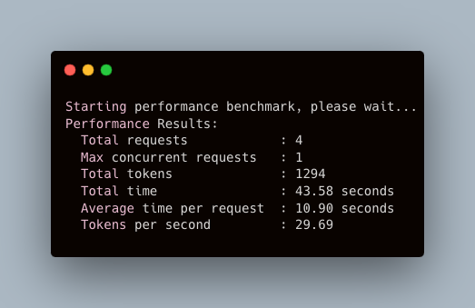

# Ollama Performance Benchmark Tool
[中文版本](https://github.com/SECSpell/Ollama_bench/blob/main/README_zh.md)

This is a performance benchmark tool written in Go, primarily designed to benchmark the local generation speed of Ollama. The tool also supports benchmark other services compatible with the OpenAI API interface specification.

## Benchmarking Principle

This tool sends multiple concurrent requests to the Ollama API service, with each request containing a randomly selected question. The tool records the total number of tokens(including output&input tokens) and request time, then calculates the average time per request and the number of tokens generated per second, thereby evaluating the performance of the Ollama API.

## Usage

1. Ensure that Ollama is running and has loaded the llama3.1:latest(8B q4_0) model.

2. Download the appropriate binary file for your system from the [Releases](https://github.com/SECSpell/Ollama_bench/releases) page.

3. Run the downloaded binary file:

   ```
   ./ollama_bench_darwin_arm64
   ```

   By default, the tool will use 1 concurrent request and send a total of 4 requests.

4. You can also specify the number of concurrent requests (C) and the total number of requests (N):

   ```
   ./ollama_bench_darwin_arm64 <C> <N>
   ```

   For example:
   ```
   ./ollama_bench_darwin_arm64 5 20
   ```
   This will use 5 concurrent requests and send a total of 20 requests.

## Configuration

Upon first launch, the tool will automatically create a `config.json` file in the same directory. You can modify this configuration as needed to support more models.

## Default mode test results for various platforms, using llama3.1:latest (8B q4_0) model with 1 concurrent request and 4 total requests.
| Test Platform | Average Tokens Generated per Second | Notes |
| --- | --- | --- |
| MacBookPro M1Pro(14cores GPU) | 30 tokens/s |  |
| MacBookPro M3Pro(14cores GPU) | 26 tokens/s | Lags behind M1Pro, possibly due to lower memory bandwidth than M1Pro. |
| AMD Ryzen R7-7840H (780M GPU) | 11 tokens/s | CPU inference |
| AMD Ryzen R7-7840H (780M GPU) | 17 tokens/s | iGPU inference, [Third-party compiled OLLAMA](https://github.com/likelovewant/ollama-for-amd) |
| AMD Ryzen R7-8845HS (780M GPU) | 17 tokens/s | iGPU inference, [Third-party compiled OLLAMA](https://github.com/likelovewant/ollama-for-amd) |
| Nvidia P106-100(6G) | 25 tokens/s | Docker ollama inference |
| Nvidia 2080ti (22G) | 86 tokens/s | GPU with modified VRAM |
| AMD RX7900XT (20G) | 113 tokens/s |  |
| Nvidia 3090 (24G) | 124 tokens/s |  |
| Groq Cloud | 581 tokens/s | Bench server on Google Cloud US East, using llama-3.1-8b-instant model |
---